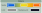
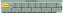
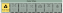

.. _colors:
.. include:: ../substitutions.rst

Colors
-----------------------

Color Selection
~~~~~~~~~~~~~~~~~

   Color of graph components can be changed.

   Preset color gradients available for nodes.

|tool| provides different methods of coloring the nodes in the visualization.
Node colors are selected on a 3-color scale that can form a gradient. Link and background colors can be also be changed.
A set of predefined color palettes are available.

.. list-table:: Color Presets
   :header-rows: 1
   :widths: 15 15 15 15 30

   * - Name
     - Color 1
     - Color 2
     - Color 3
     - Gradient
   * - Primary
     - .. raw:: html

          

     - .. raw:: html

          

     - .. raw:: html

          

     - .. raw:: html

          

   * - Peach
     - .. raw:: html

          

     - .. raw:: html

          

     - .. raw:: html

          

     - .. raw:: html

          

   * - Mystic
     - .. raw:: html

          

     - .. raw:: html

          

     - .. raw:: html

          

     - .. raw:: html

          

   * - Purples
     - .. raw:: html

          

     - .. raw:: html

          

     - .. raw:: html

          

     - .. raw:: html

          

   * - Greens
     - .. raw:: html

          

     - .. raw:: html

          

     - .. raw:: html

          

     - .. raw:: html

          

   * - Blues
     - .. raw:: html

          

     - .. raw:: html

          

     - .. raw:: html

          

     - .. raw:: html

          

   * - Heat
     - .. raw:: html

          

     - .. raw:: html

          

     - .. raw:: html

          

     - .. raw:: html

          

   * - GoldenTide
     - .. raw:: html

          

     - .. raw:: html

          

     - .. raw:: html

          

     - .. raw:: html

          

   * - Iris
     - .. raw:: html

          

     - .. raw:: html

          

     - .. raw:: html

          

     - .. raw:: html

          

   * - Sorbet
     - .. raw:: html

          

     - .. raw:: html

          

     - .. raw:: html

          

     - .. raw:: html

          

   * - CoralSky
     - .. raw:: html

          

     - .. raw:: html

          

     - .. raw:: html

          

     - .. raw:: html

          

   * - Viridis
     - .. raw:: html

          

     - .. raw:: html

          

     - .. raw:: html

          

     - .. raw:: html

          

   * - Mako
     - .. raw:: html

          

     - .. raw:: html

          

     - .. raw:: html

          

     - .. raw:: html

          

   * - Magma
     - .. raw:: html

          

     - .. raw:: html

          

     - .. raw:: html

          

     - .. raw:: html

          

   * - Rocket
     - .. raw:: html

          

     - .. raw:: html

          

     - .. raw:: html

          

     - .. raw:: html

          

.. note:: 
    Some palettes are better for discrete colors and some are better for heatmap gradients. An attempt was made to provide multiple colorblind-friendly palettes but not all of them are guaranteed to be safe.

Color Style
~~~~~~~~~~~~~~~~~

   Different coloring styles can be applied to nodes.

Depending on the mode selected, the colors will either be used to form as a continuous gradient or will be used as three discrete colors. 

.. raw:: html

     

          

          <i class="fa-solid fa-circle-nodes"></i>
          

               
Node Type <code>discrete</code>

               
The color is determined by the type of node: segment, bubble, or chain.

          

          

          

          <i class="fa-solid fa-arrows-to-circle"></i>
          

               
Bubble Size <code>continuous</code>

               
The color is determined by the total number of segments inside a bubble or chain. Not to be confused with length, which is based on total basepairs.

          

          

          

          <i class="fa-solid fa-arrow-down-short-wide"></i>
          

               
Node Length <code>continuous</code>

               
The color is determined by the total number of basepairs represented by a node.

          

          

          

          <i class="fa-solid fa-shuffle"></i>
          

               
Ref/Alt <code>discrete</code>

               
Reference and alternative paths are colored differently using a 2-color scheme from the gradient ends.

          

          

          

          <i class="fa-solid fa-dna"></i>
          

               
GC Content <code>continuous</code>

               
The color is determined by the GC percentage of all basepairs represented by a node (with the human genome averaging ~41%).

          

          

     

