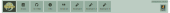

.. _navbar:
.. include:: ../substitutions.rst

Navigation Bar
==================================

Navigation Bar Buttons
--------------------------

   Buttons on the navigation bar.

.. raw:: html

   

   

      <i class="fa-solid fa-book"></i>
      

         
Documentation

         
This is what you are reading now!

      

   

   

      <i class="fa-brands fa-github"></i>
      

         
GitHub

         
Source code.

      

   

   

      <i class="fa-solid fa-bug"></i>
      

         
Bug Reports

         
Report issues and bugs.

      

   

   

      <i class="fa-solid fa-circle-info"></i>
      

         
Information

         
Pops up some current information.

      

   

   

      <i class="fa-solid fa-quote-right"></i>
      

         
Citation

         
How to cite PangyPlot.

      

   

   

      <i class="fa-solid fa-vial"></i>
      

         
Example Regions

         
Preloaded demo regions.

      

   

   

Instance Information
--------------------------

   Instance information is shown on the right side.

Version number of |tool| is shown along with genome build used for the cytoband display. Organism and genome build is specified during setup. 