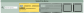

.. _regions:
.. include:: ../substitutions.rst

Choosing a Region
==================================

Selecting by Chromosome
--------------------------

   Genome cytoband selector.

   Chromosome cytoband selector.

Cytoband data is specified during setup. The default is human hg38. 
A chromosome can be selected by clicking on it. Non-canonical chromosomes can be found in the ``Other`` selection box.
A cytoband view of the selected chromosome is rendered. Clicking and dragging along the chromosome will select a specific region.

.. note::
   Currently there is a limitation on the size of the region that can be viewed. Enabling arbitrarily large regions for viewing is a future goal.

Selecting by Gene
--------------------------

Gene annotations data is specified during setup. The gene search bar will search for any preloaded genes. The last four searches are saved as buttons.

   Select by Gene.

Selecting by Coordinate
--------------------------

|tool| uses a coordinate system based on one of the reference paths embedded in the sequence graph. The primary coordinate system is specified during setup — typically using a reference genome such as hg38 or t2t for humans.

.. raw:: html

   Selection methods above will fill the <i class="fas fa-crosshairs"></i> with a set of coordinates.

   Coordinate section.

.. raw:: html

   

      

         <i class="fa-solid fa-crosshairs"></i>
         

            
Enter coordinates

            
Manually enter or adjust the coordinate range.

         

      

      

         <i class="fa-solid fa-copy"></i>
         

            
Copy coordinates

            
Copy the current coordinate range.

         

      

      

         <i class="fa-solid fa-plus-minus"></i>
         

            
Set flanking

            
Set the number of flanking base pairs to include.

         

      

      

         <i class="fa-solid fa-minus"></i>
         

            
Upstream flanking

            
Include flanking sequence upstream of the coordinate range.

         

      

      

         <i class="fa-solid fa-plus"></i>
         

            
Downstream flanking

            
Include flanking sequence downstream of the coordinate range.

         

      

      

         <i class="fa-solid fa-bolt-lightning"></i>
         

            
Go

            
Retrieve and display the specified coordinate range.

         

      

   

