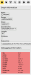
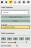
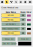
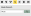
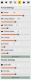
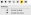
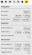

.. _tools:
.. include:: ../substitutions.rst

Tools
==================================

Tool Tabs
~~~~~~~~~~~~~~~~~~~

.. raw:: html

   

     <a href="#graph-information" title="Graph Information">
       <i class="fa-solid fa-circle-info"></i>
     </a>
     <a href="#gene-annotations" title="Gene Annotations">
       <i class="fa-solid fa-tag"></i>
     </a>
     <a href="#path-selector" title="Path Selector">
       <i class="fa-solid fa-diagram-project"></i>
     </a>
     <a href="#search" title="Search">
       <i class="fa-solid fa-magnifying-glass"></i>
     </a>
     <a href="#settings" title="Settings">
       <i class="fa-solid fa-sliders"></i>
     </a>
     <a href="#options" title="Options">
       <i class="fa-solid fa-gear"></i>
     </a>
     <a href="#input-commands" title="Input Commands">
       <i class="fa-solid fa-keyboard"></i>
     </a>
   

Select the icon to jump to the relevant section.

Graph Information
~~~~~~~~~~~~~~~~~~~

.. note::
   Under active development.

   Display for graph information.

When a node is selected, information about that node will be displayed here. Icons for each node type:

.. raw:: html

  

    

      <i class="fa-regular fa-square"></i>
      

        
Segment

        
Corresponds to <code>S</code> line in GFA.

      

    

    

      <i class="fa-regular fa-circle"></i>
      

        
Bubble

        
A bubble containing one or more segments.

      

    

    

      <i class="fa-solid fa-right-to-bracket"></i>
      

        
Bubble Source

        
The source node for a bubble. Revealed when a bubble is popped.

      

    

    

      <i class="fa-solid fa-right-from-bracket"></i>
      

        
Bubble Sink

        
The sink node for a bubble. Revealed when a bubble is popped.

      

    

  

.. note::
   Debugging information will be displayed here if the instance was started in debug mode.

Path Selector
~~~~~~~~~~~~~~~~~~~

   Tools for viewing paths.

Select a sample to view the paths that are contained in the subgraph currently being viewed. "Show All Paths" will highlight links touched by any path in that sample.
Selecting a specific graph can enable animation of it. You can play through the steps of the path using the controls below.

.. raw:: html

  

    

      <i class="fa-solid fa-play"></i>
      

        
Play

        
Start playback of the path animation.

      

    

    

      <i class="fa-solid fa-backward-step"></i>
      

        
Previous

        
Go back to the previous step.

      

    

    

      <i class="fa-solid fa-forward-step"></i>
      

        
Next

        
Advance to the next step.

      

    

    

      <i class="fa-solid fa-pause"></i>
      

        
Pause

        
Pause the animation at the current step.

      

    

    

      <i class="fa-solid fa-rotate-left"></i>
      

        
Reset

        
Restart the animation from the beginning.

      

    

Gene Annotations
~~~~~~~~~~~~~~~~~~~

   Adjusting annotations.

Each annotation has three options:

- Toggle visibility (by clicking on gene name)
- Draw exons only (by clicking on the icon)
- Change color (by clicking on the color swatch)

.. raw:: html

    

      

          <i class="fa-solid fa-eye"></i>
          

          
Draw exons

          
When enabled, exons will be drawn on the graph instead of full genes.

          

      

    

Search
~~~~~~~~~~~~~~~~~~~

.. note::
   More options will be added here over time.

   Search features.

Currently this section only supports searching for nodes by ID. Clicking on a search result will center the canvas view on that node.

Settings
~~~~~~~~~~~~~~~~~~~

   Adjust forces and rendering settings.

.. raw:: html

  

    

      <i class="fa-solid fa-atom"></i>
      

        
Charge

        
Controls the repulsive force applied to nodes.

      

    

    

      <i class="fa-solid fa-arrows-left-right-to-line"></i>
      

        
Charge Distance

        
Sets the maximum distance over which nodes exert charge force.

      

    

    

      <i class="fa-solid fa-explosion"></i>
      

        
Node Collision

        
Prevents nodes from overlapping by applying collision force.

      

    

    

      <i class="fa-solid fa-ruler-horizontal"></i>
      

        
Collision Radius

        
The radius around a node that determines a collision.

      

    

    

      <i class="fa-solid fa-arrows-left-right"></i>
      

        
Link Size

        
Shrinks or grows target link length.

      

    

    

      <i class="fa-solid fa-person-skating"></i>
      

        
Friction

        
Dampens node motion, slowing down layout movement.

      

    

    

      <i class="fa-solid fa-circle-nodes"></i>
      

        
Layout Impulse

        
Applies a force that drives nodes to their initial layout positions.

      

    

    
    

    
    

      <i class="fa-solid fa-circle-plus"></i>
      

        
Node Width

        
Adjusts the thickness of node rendering.

      

    

    

      <i class="fa-solid fa-text-width"></i>
      

        
Font Size

        
Changes the annotation label font sizes.

      

    

  

Options
~~~~~~~~~~~~~~~~~~~

.. note::
   More options will be added here over time.

   Miscellaneous options.

.. raw:: html

    

      

          <i class="fa-solid fa-anchor"></i>
          

          
Anchor on drag

          
Fixes a node to a dragged position when enabled.

          

      

      

          <i class="fa-solid fa-paint-roller"></i>
          

          
Smooth GC colors

          
Smooths out color in GC style by averaging GC content over a node and its neighbors.

          

      

    

Input Commands
~~~~~~~~~~~~~~~~~~~

   Self-explanatory list of input commands.