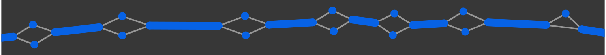
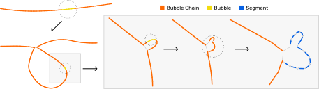
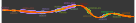

.. _visuals:
.. include:: ../substitutions.rst

Viewing the Pangenome
==================================

Node Types
~~~~~~~~~~~~~~~~~~~

   Segments = ``S`` lines from GFA files (blue). Links = ``L`` lines from GFA files (gray).

.. figure:: ../_images/graph/bubble_chain.svg
   :alt: bubble and chain
   :align: center
   :width: 100%

   A chain of bubbles. Each bubble in the chain is shown in yellow, the chain links are orange. 

|tool| First displays top-level bubbles. Bubbles can be popped to reveal finer-scale details.

   Iterative bubble popping to the segment level.

Gene Annotations
~~~~~~~~~~~~~~~~~~~

The gene annotations are provided during setup up |tool|. The HPRC live instance uses annotations from `GENCODE <https://www.gencodegenes.org/human/>`_ (any GFF3 file can be used).

Annotations are rendered as outlines around nodes and edges:

   Example of rendered gene annotations.

Interactions
~~~~~~~~~~~~~~~~~~~

.. raw:: html

   

      

         <i class="fa-solid fa-arrow-pointer"></i>
         

            
Selection Mode <code>default</code>

            
Click nodes to select and drag.

         

      

      

         <i class="fa-solid fa-hand-pointer"></i>
         

            
Bubble Pop Mode <code>ctrl key</code>/<code>cmd key</code>

            
Click nodes to pop bubbles.

         

      

      

         <i class="fa-solid fa-up-down-left-right"></i>
         

            
Pan/Zoom Mode <code>shift key</code>

            
Click and drag to pan the view. Use mouse wheel to zoom in and out.

         

      

      

         <i class="fa-solid fa-arrows-to-circle"></i>
         

            
Recenter on Subgraph <code>space bar</code>

            
Press the space bar to recenter the view on the full subgraph.

         

      

      

         <i class="fa-solid fa-arrows-to-dot"></i>
         

            
Recenter on Selection <code>up arrow</code>

            
Press the up arrow key to recenter the view on the selected nodes.

         

      

      

         <i class="fa-solid fa-anchor"></i>
         

            
Anchor on Drag <code>F key</code>

            
Press the F key to toggle whether a node position is fixed after dragging.

         

      

   

Right-Click Menu
~~~~~~~~~~~~~~~~~~~

.. warning::
   "Download GFA" is currently broken.

Actions performed on the full subgraph:

.. raw:: html

   

      

         <i class="fa-solid fa-arrows-to-circle"></i>
         

            
Recenter Graph

            
Zoom to fit the entire subgraph in view.

         

      

      

         <i class="fa-solid fa-file-export"></i>
         

            
Download GFA

            
Export the current subgraph as a GFA file.

         

      

      

         <i class="fa-solid fa-download"></i>
         

            
Download PNG

            
Export the current subgraph as a PNG image.

         

      

      

         <i class="fa-solid fa-download"></i>
         

            
Download SVG

            
Export the current graph as an SVG vector image.

         

      

   

   

Actions performed on a selected set of nodes:

.. raw:: html

   

      

         <i class="fa-solid fa-burst"></i>
         

            
Pop nodes

            
Pop selected bubbles.

         

      

      

         <i class="fa-solid fa-dna"></i>
         

            
Show Sequence

            
Display truncated sequence for selected nodes.

         

      

      

         <i class="fa-solid fa-pen"></i>
         

            
Add Custom Label

            
Assign a custom text label to selected nodes.

         

      

      

         <i class="fa-solid fa-tag"></i>
         

            
Add Custom Annotation

            
Create a custom gene annotation on selected nodes.

         

      

      

         <i class="fa-solid fa-trash-can"></i>
         

            
Clear Labels

            
Remove all custom text labels from nodes.

         

      

      

         <i class="fa-solid fa-lock-open"></i>
         

            
Unlock nodes

            
Allow nodes to move freely again.

         

      

      

         <i class="fa-solid fa-lock"></i>
         

            
Lock nodes

            
Fix node positions to their current coordinates.

         

      

   

