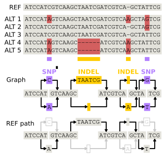
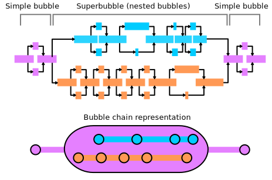

.. _principles:
.. include:: substitutions.rst

Core Concepts
==================================

Motivation for |tool|
---------------------

A visual interface is fundamental for detecting patterns and gaining meaningful insights into large, complex genomic datasets.
Pangenomes typically rely on a graph-based data structure, which is very difficult to navigate without a visualization of the graph topology.

   caption here

Graph genomes are particularly challenging to analyze because they include billions of base pairs and encompass all the potential variations within them.
The range of variation size is also large. For instance, examining the relationship between a SNP and a 20kb structural variant represents a 20,000-fold difference in scale.

To overcome these issues, consider the system used for structuring physical locations:

   Physical locations have a hierarchical relationship. The level of detail needed depends on the goal.
 

Online map applications need to meet a diverse set of demands: from navigating between countries, finding an intersection, directions to the front door of a building. 
These applications hide unnecessary details based on the user's zoom level, focusing on major highways or rail lines when zoomed out and only showing the name of tiny side streets when zoomed all the way in.

   Genetic variation has a hierarchical relationship. The level of detail needed also depends on the goal.
 
Likewise, analysis of genetic variation can happen at very different scales from the chromosomal level, to structural variation to indivdual SNPs.
|tool| aims to capture common topological patterns in graph genomes and builds a hierarchical structure of the variation in the genome.
This allows users to control the level of detail visible and also limits the computation necessary to view large regions by abstracting the details.

Pangenome visualization is challenging due to the scale and complexity inherent in genomic graph data. Below we outline the core obstacles and how |tool| approaches them.

Managing Billions of Nodes and Edges
------------------------------------

Pangenome graphs contain massive volumes of data, often billions of segments and links. |tool| uses [database info]

Optimizing Layout
-----------------

Visualizing pangenome graphs requires organizing the graph into two dimensions.

- The initial x-coordinate and y-coordinate positions are computed via `odgi layout`_.
- Dynamic web-based graph rendering and physics are powered by `force-graph`_ (based on `D3.js`_).

Balancing Large and Small Variants
----------------------------------

   caption here

Complex variation such as structural variants (SVs) coexists with smaller variants like SNPs and indels, and it can be difficult to visualize them together.

`BubbleGun`_ identifies "bubbles", "superbubbles", and "bubble chains" within GFA data. These bubble structures can be collapsed to simplify the graph and reduce clutter. Users can selectively "pop" open bubbles to explore fine-scale variation when needed. An implementation of this algorithm is included in |tool|.

Coordinate Systems and Annotations
----------------------------------

Genomic coordinate systems are essential for querying and aligning biological features. While pangenomic data does not inherently have a primary coordinate system, |tool| was developed under a design philosophy that requires one. When uploading a graph, users designate a primary path to serve as the coordinate reference system.

`odgi position`_ is used to establish the start and end positions of segments. Segments that are not part of the primary coordinate system are anchored to the nearest segment on the primary path.

With coordinates established, standard GFF3 annotation files can be imported to enable feature visualization and biological interpretation.

.. _force-graph: https://github.com/vasturiano/force-graph
.. _D3.js: https://d3js.org/
.. _BubbleGun: https://github.com/fawaz-dabbaghieh/bubble_gun
.. _odgi layout: https://pangenome.github.io/odgi.github.io/rst/commands/odgi_layout.html
.. _odgi position: https://pangenome.github.io/odgi.github.io/rst/commands/odgi_position.html
